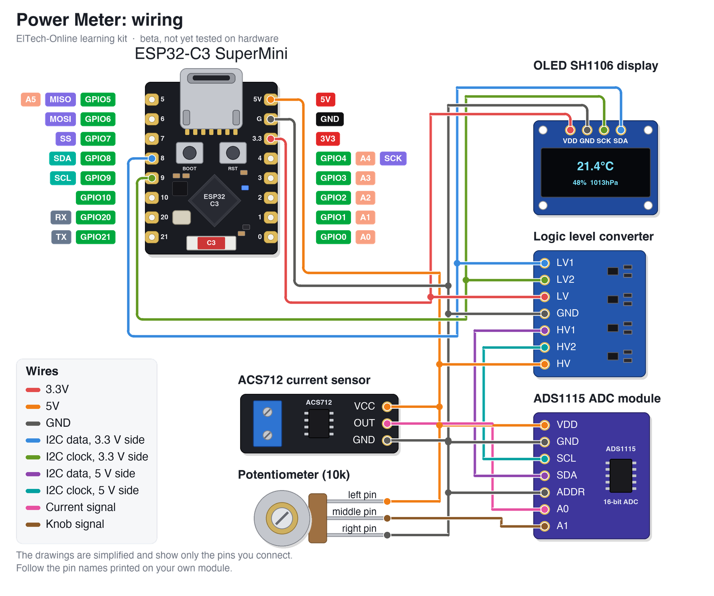

# ElTech-Online ESP32-C3 Power Meter

[](https://buymeacoffee.com/eltech)

> **Status: BETA, not tested.** The code compiles for the ESP32-C3, but this kit has not been built and tested on real hardware yet. Pin choices, default values and the wiring may still change. Use it to read and learn from; expect to do some fault-finding if you build it now.

A beginner-friendly **learning kit**: build a DC power meter from an **ESP32-C3 SuperMini**, an **ACS712 current sensor**, an **ADS1115 16-bit converter**, a **logic level converter**, a **potentiometer** and a **1.3" OLED SH1106** display. It shows the amps and watts a low-voltage device draws and how much battery charge (mAh) it has used. No prior electronics or coding experience needed, and no soldering: everything plugs into a breadboard.

Designed, coded and documented by ElTech-Online in Callander, Scotland — the kit design, firmware and this guide are our own work.


## What you'll learn

Three techniques that turn up in almost every measuring project:

- **Current sensing** — how a Hall-effect sensor turns current into a voltage
- **An external ADC** — why the ESP32's own converter isn't good enough here, and reading a better one over I2C
- **Level shifting** — letting a 5 V part and a 3.3 V board share the same I2C wires safely
- **Talking to a chip without a library** — writing to and reading from its registers directly

Along the way you'll also pick up:

- **Zeroing (taring)** a sensor and saving the zero point in flash
- **Integrating** — adding up current over time to get mAh, and power over time to get Wh
- **Averaging** to tame a noisy signal

The code is written to be read: every section is commented in plain language, and [How the code works](#how-the-code-works) walks through it.

## How the parts work

**The current sensor.** The current you are measuring flows through a thick copper path inside the ACS712 chip, between the two screw terminals. Current makes a magnetic field, and a Hall-effect sensor in the chip turns that field into a voltage on the OUT pin. With no current OUT sits at half the supply (about 2.5 V). The 20 A version moves **100 mV per amp**, up for current one way and down for the other. The measured circuit never touches the ESP32: they are electrically separate.

**The converter.** The ESP32's own ADC has 12 bits and only measures accurately up to about 2.5 V. The sensor's output goes to nearly 5 V and 1 amp is only 100 mV of it. The ADS1115 has 16 bits: at the range used here each step is 0.1875 mV, which is about 2 mA.

**The level converter.** To measure up to 5 V the ADS1115 has to be powered from 5 V, and then its I2C wires idle at 5 V too. That is more than an ESP32 pin should see. The level converter sits between them: each channel is one transistor and two resistors that let either side pull the wire LOW while each side only ever sees its own HIGH voltage.

**The knob.** The potentiometer is a voltage divider. Its middle pin gives 0 to 5 V as you turn it, read on the ADS1115's second input and used as the over-current warning limit.

> **Safety:** **low-voltage DC only** (batteries, USB, bench supplies up to 24 V). Never connect mains electricity to this kit.

## What it does

- Measures current twice a second, averaged over 8 readings
- Works out power from the supply voltage you type on the web page
- Adds up charge (mAh) and energy (Wh) since power-on or since you reset them
- The knob sets a warning limit from 0 to 5 A; the OLED flashes **OVER LIMIT** above it
- Web page: current, power, mAh, Wh, the limit, **Set zero** and **Reset totals**

It also runs a self-test at power-on and prints it to Serial (115200 baud):

```
--- Self-test ---
OLED (SH1106): OK
ADS1115:       OK
ACS712:        OK (2504 mV at rest)
Knob:          1830 mV (turn it and watch the limit change)
WiFi AP:       OK
RESULT:        PASS
```

Run the self-test with nothing connected to the sensor's screw terminals.

There are **two sketches** in this repo:

| Sketch | What it is |
|---|---|
| `ads1115_test/` | The smallest useful start: prints the voltage on the converter's two inputs once a second. Begin here. |
| `power_meter/` | The full project: sensor + converter + OLED + web page. |

## Hardware

| Component | Notes |
|---|---|
| ESP32-C3 SuperMini |  |
| ACS712 current sensor module, 20 A | 3 pins: `VCC`, `OUT`, `GND`, plus two screw terminals for the measured current |
| ADS1115 16-bit ADC module | 10 pins. Used here: `VDD`, `GND`, `SCL`, `SDA`, `ADDR`, `A0`, `A1` |
| 4-channel logic level converter | Two rows of 6 pins: `LV1 LV2 LV GND LV3 LV4` and `HV1 HV2 HV GND HV3 HV4` |
| 10 kΩ potentiometer | 3 pins. The middle one is the output |
| 1.3" OLED, SH1106 driver, 128×64, I2C | Address `0x3C` (try `0x3D` if blank) |
| Breadboard + jumper wires | 22 wires |

## Wiring

| Wire | ESP32-C3 pin | Connects to |
|---|---|---|
| 3.3V | 3V3 | OLED SH1106 display `VDD`, Logic level converter `LV` |
| 5V | 5V | Logic level converter `HV`, ADS1115 ADC module `VDD`, ACS712 current sensor `VCC`, Potentiometer `left pin` |
| GND | GND | OLED SH1106 display `GND`, Logic level converter `GND`, ADS1115 ADC module `GND`, ADS1115 ADC module `ADDR`, ACS712 current sensor `GND`, Potentiometer `right pin` |
| I2C data, 3.3 V side | GPIO 8 | OLED SH1106 display `SDA`, Logic level converter `LV1` |
| I2C clock, 3.3 V side | GPIO 9 | OLED SH1106 display `SCK`, Logic level converter `LV2` |
| I2C data, 5 V side | — | Logic level converter `HV1`, ADS1115 ADC module `SDA` |
| I2C clock, 5 V side | — | Logic level converter `HV2`, ADS1115 ADC module `SCL` |
| Current signal | — | ACS712 current sensor `OUT`, ADS1115 ADC module `A0` |
| Knob signal | — | Potentiometer `middle pin`, ADS1115 ADC module `A1` |



The parts are drawn in a simplified way, showing only the pins you connect. **Always follow the labels printed on your own modules** — the pin order differs between manufacturers.

Good to know:

- **Two power rails.** Put 3V3 on one of the breadboard's power rails and 5V on the other, and take care which is which.
- **The OLED is on the 3.3 V side** of the level converter, wired straight to GPIO 8 and 9. **The ADS1115 is on the 5 V side.**
- **ADDR to GND** gives the ADS1115 the address `0x48`.
- **Either GND pin** of the level converter will do: the two are joined on the board.
- **The screw terminals go in series with your load:** cut into one wire going to the load and put the sensor in the gap. Never connect them across a supply.

## Setup (Arduino IDE)

**Before you start:** download and install the free **Arduino IDE 2** from [arduino.cc/en/software](https://www.arduino.cc/en/software). The ESP32-C3 connects over its own USB-C port, so there's no separate USB driver to install. Use a USB cable that carries data: some cheap cables only charge, and then the board never shows up.

1. **Add the ESP32 board index**: `File > Preferences` → Additional Boards Manager URLs:
   ```
   https://raw.githubusercontent.com/espressif/arduino-esp32/gh-pages/package_esp32_index.json
   ```
2. **Install the board package**: `Tools > Board > Boards Manager`, search "esp32", install **esp32 by Espressif Systems**.
3. **Select the board**: `Tools > Board > esp32 > ESP32C3 Dev Module`.
4. **Tools menu settings**:

   | Setting | Value |
   |---|---|
   | Board | ESP32C3 Dev Module |
   | USB CDC On Boot | Enabled |
   | CPU Frequency | 160MHz |
   | Erase All Flash Before Sketch Upload | Disabled |
   | Flash Size | 4MB (32Mb) |
   | Partition Scheme | Default 4MB with spiffs (1.2MB APP/1.5MB SPIFFS) |
   | Upload Speed | 921600 |

5. **Install libraries** via `Sketch > Include Library > Manage Libraries`:
   - Adafruit SH110X
   - Adafruit GFX Library

   If Library Manager asks to install dependencies (Adafruit BusIO, Adafruit Unified Sensor), click **Install all**.

   **Compiled with** these versions (compile-tested only; hardware confirmation pending):

   | Package | Version |
   |---|---|
   | esp32 by Espressif Systems (board package) | 3.3.11 |
   | Adafruit SH110X | 2.1.15 |
   | Adafruit GFX Library | 1.12.6 |
   | Adafruit BusIO | 1.17.4 |

6. Open `ads1115_test/ads1115_test.ino` first, upload it, and check both readings. Then open `power_meter/power_meter.ino` and upload that.

### Opening the Serial Monitor

1. Open it with `Tools > Serial Monitor`.
2. Set the speed drop-down to **115200 baud**. At the wrong speed, you'll see garbled characters or nothing at all.
3. The self-test only runs once, right after the board starts. If you opened the Serial Monitor too late, press the board's **RST** (reset) button to run it again.

**Seeing nothing at all?** Check that `Tools > USB CDC On Boot` is set to **Enabled**.

### If the upload fails

If the upload stops with an error like `Failed to connect`, put the board into download mode by hand:

1. Hold down the **BOOT** button on the board.
2. While holding it, press and release **RST** (or unplug and re-plug the USB cable).
3. Release **BOOT**, choose the port under `Tools > Port` and click **Upload** again.
4. When the upload finishes, press **RST** once to start the new code.

## The web page

1. Upload the main sketch. Every board creates its **own** network name (e.g. `ElTech-PW-A3F2`) and its **own** random 8-character password, saved in the board's flash memory.
2. The OLED and Serial Monitor show the network name, the password and the address `http://192.168.4.1`.
3. On your phone or laptop, connect to that WiFi network, then open that address in a browser. Your phone may warn that the network has no internet: that is expected, stay connected.

This is a standalone Access Point, not connected to your home WiFi or the internet. Range is roughly a typical room. The WiFi code and the page's style sheet live in `eltech_wifi.h`, a second tab in the sketch, so the main file can stay about this kit's own lesson.

## Zeroing and measuring

1. With nothing connected to the screw terminals, open the web page and press **Set zero**. The meter now knows what "no current" looks like for your sensor. It is saved in flash.
2. Type the supply voltage of the thing you are measuring (for example `5` for USB, `12` for a 12 V supply).
3. Wire the screw terminals in series with one wire to your load, and switch it on.

No phone to hand? In Serial Monitor, type `z` (set zero) or `r` (reset totals) and press Enter.

**What to expect:** this is a 20 A sensor, so it is at its best from about 0.2 A upwards. Readings jitter by a few tens of milliamps, and anything under 0.06 A is shown as zero. A motor, a strip of LEDs or a phone charging are good things to measure; a single LED is too small.

## How the code works

Open `power_meter/power_meter.ino` alongside this section. The file starts with a short guide to its own layout. Every Arduino sketch has two main functions: `setup()` runs once when the board starts, and `loop()` then runs over and over, forever.

1. **Settings at the top.** Pins, the sensor's mV-per-amp figure and the limit's full scale are named values you can change in one place.
2. **Reading the ADS1115.** `readAdsMillivolts()` writes a 16-bit setting into the chip's config register, waits, and reads the result register. The comment above it explains every bit.
3. **Measuring.** `measure()` turns the voltage into amps, then watts, and adds the last half second's worth onto the mAh and Wh totals.
4. **Zeroing.** `setZero()` averages 32 readings and saves them with the `Preferences` library.
5. **The web server.** `/data` sends the measurements as JSON; `/zero`, `/reset` and `/volts` change things.
6. **The self-test.** `runSelfTest()` checks the ADS1115 answers at its address, which also proves the level converter is passing signals both ways.

## Try this next

Small changes to try yourself, roughly easiest first. Change one thing, upload, and check the result before moving on.

1. **Change the limit's range.** Edit `LIMIT_FULL_SCALE_AMPS`.
2. **Use more of the ADS1115's precision.** Change the range bits in `readAdsMillivolts()` and the matching `ADS_MV_PER_STEP` (the datasheet's table lists them).
3. **Measure the supply voltage too**, instead of typing it. Up to 5 V can go straight into `A2`; for more, add a two-resistor divider.
4. **Show the peak current** since the last reset.
5. **Estimate battery life.** Type the battery's capacity in mAh on the page and show the hours left at the present current.

## Beta notes

This repository is published early. Still to be confirmed on real hardware:

- I2C through the level converter at the default 100 kHz with both the OLED and the ADS1115 on the bus
- The ACS712's noise floor and zero drift, and whether `NOISE_FLOOR_AMPS` is set sensibly
- Whether jumper wire pins hold firmly in the ACS712's screw terminals

Found a problem? Please open an issue on this repository.

## License

The code, documentation and wiring diagram are MIT-licensed — see [LICENSE](LICENSE). Use them, modify them, build your own kit with them.

**The ElTech-Online name and logo are not covered by the MIT license.** The logo files (`logo.png` and any `logo_bitmap.h`) are © ElTech-Online, all rights reserved. If you build or sell your own version, swap in your own logo and don't present it as an ElTech-Online product.
